<h1 align="center">基于SpringBoot的景区订票系统【带论文】</h1>

- <b>完整代码获取地址：从戎源码网 ([https://armycodes.com/](https://armycodes.com/))</b>
- <b>技术探讨、资料分享，请加QQ群：692619798</b>
- <b>作者微信：19941326836  QQ：3645296857</b>
- <b>承接计算机毕业设计、Java毕业设计、Python毕业设计、深度学习、机器学习</b>
- <b>选题+开题报告+任务书+程序定制+安装调试+论文+答辩ppt 一条龙服务</b>
- <b>所有选题地址 ([https://github.com/Descartes007/allProject](https://github.com/Descartes007/allProject)) </b>

## 一、项目介绍

基于SpringBoot的景区订票系统，系统角色为管理员（后台）和普通用户（前端），主要功能如下：
### 管理员（后台）：
- 基本操作：登录、修改密码、获取/修改个人信息、登出
- 用户管理：用户列表/详情、新增/修改/删除用户、重置密码、批量导入（xls）
- 景点管理：景点列表/详情、新增/修改/删除景点、批量导入
- 订单管理：订单列表/详情、手工保存/修改/删除订单、查看并处理用户预定（含余额变更）
- 收藏管理：景点收藏记录的列表/新增/删除
- 留言/论坛管理：帖子与景点留言的 CRUD 与审核
- 公告与轮播图（配置）管理：公告与配置（轮播图）CRUD
- 文件管理：文件上传/管理（static/upload）、导入/导出（Excel）
### 普通用户（前端）：
- 账号：注册、登录、修改个人信息、查看会话/退出、找回/重置密码
- 景点浏览：景点列表、详情、筛选/排序、查看图片与内容
- 收藏与留言：收藏景点、查看/新增景点留言
- 论坛/公告：查看公告列表与论坛帖子、发帖/回复（前端公开接口）
- 预定/支付：下单预定景点（创建订单）、使用账户余额支付、查看订单列表与详情
- 个人中心：查看/编辑个人信息、查看我的订单/收藏

## 二、项目技术

- 编程语言：Java（后端）、Vue（前端）
- 项目架构：B/S前端技术：
- 框架：Vue 2 + vue-router，Element UI，Axios（封装在 src/utils/http.js）
- 后端技术：，Spring Boot 2.2.x，MyBatis / MyBatis-Plus，MySQL，Fastjson、Hutool、、Commons-IO

## 三、运行环境

- JDK版本：1.8及以上都可以
- 操作系统：Windows7/10、MacOS
- 开发工具：IDEA、Ecplise、MyEclipse都可以

## 四、数据库配置文件

- npm版本：6.14.13及以上都可以
- Redis版本：3.2.100及以上都可以
- 文件名：application.yml
- 编码类型：utf8

## 论文截图

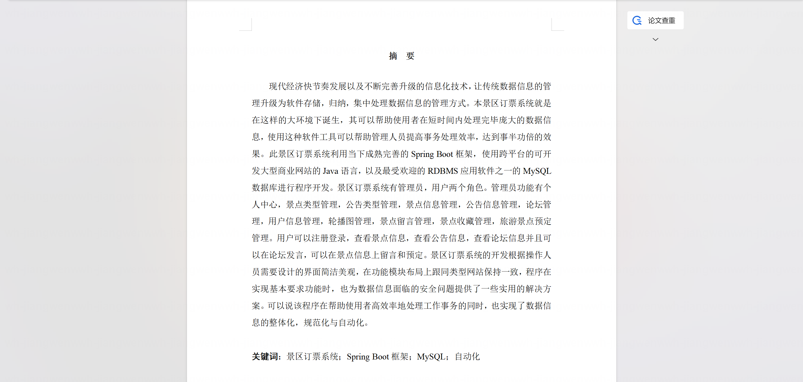

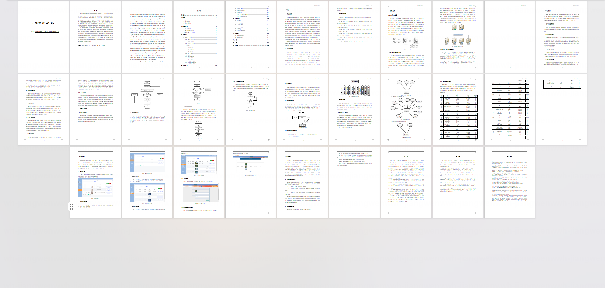

## 系统截图

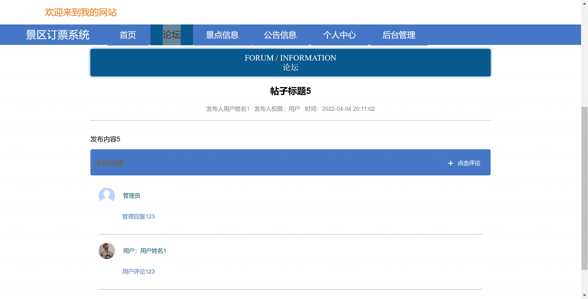

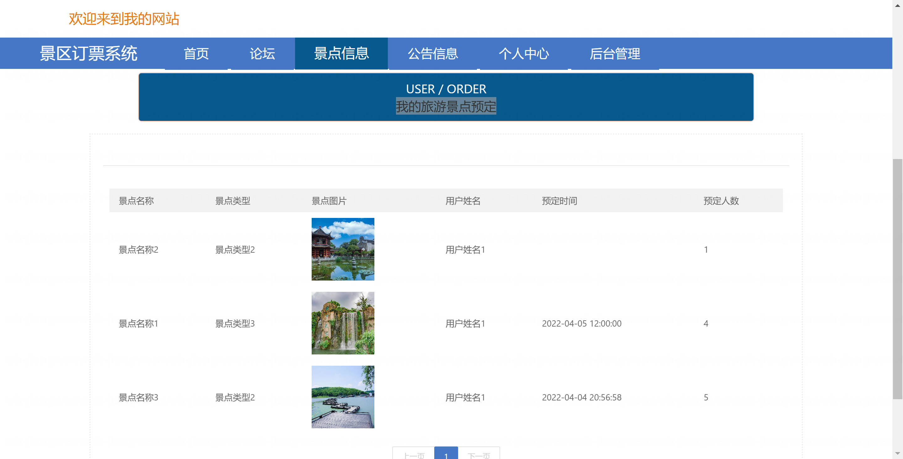

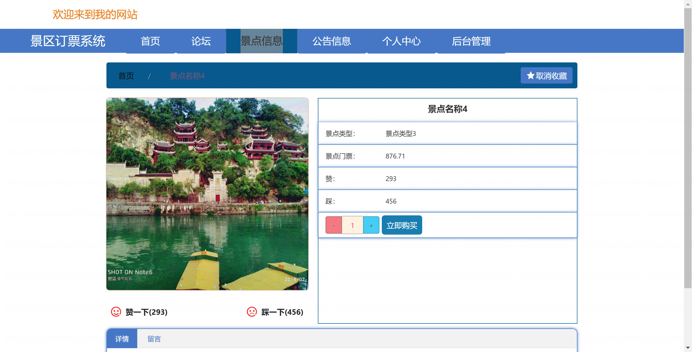

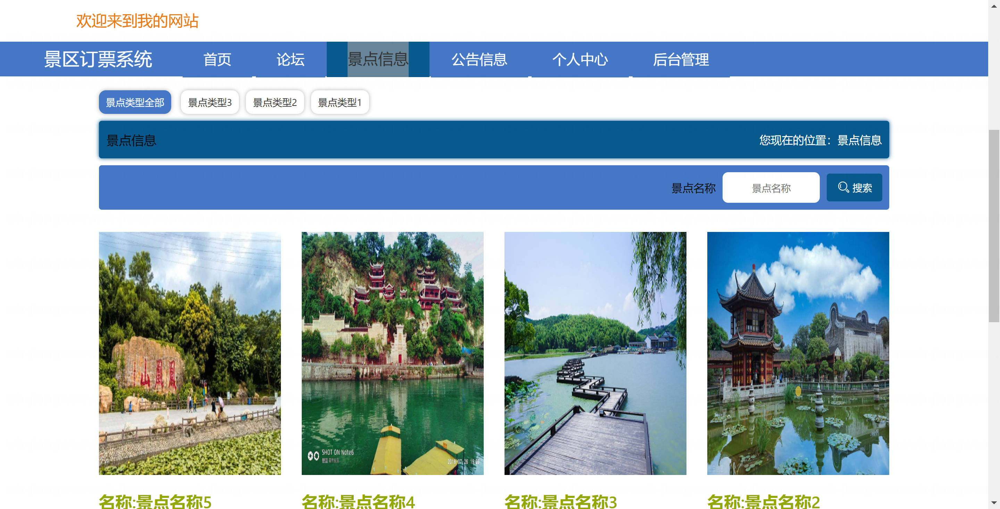

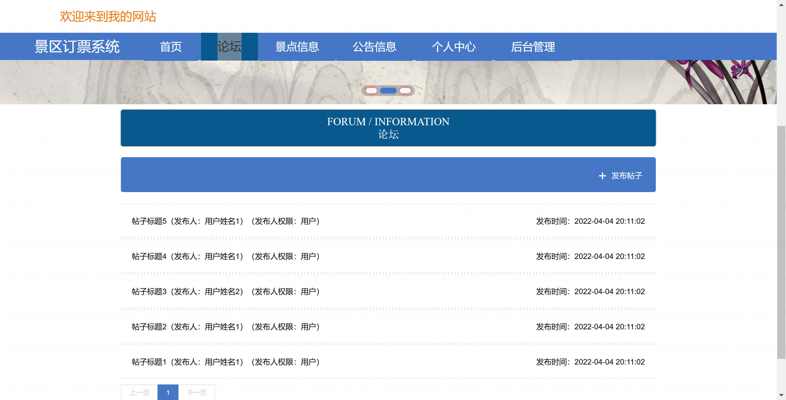

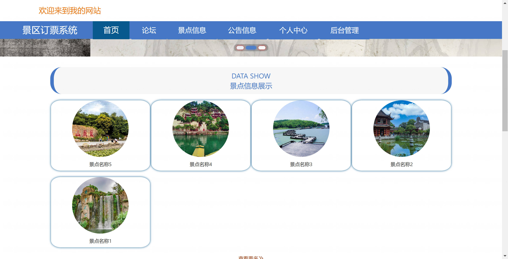

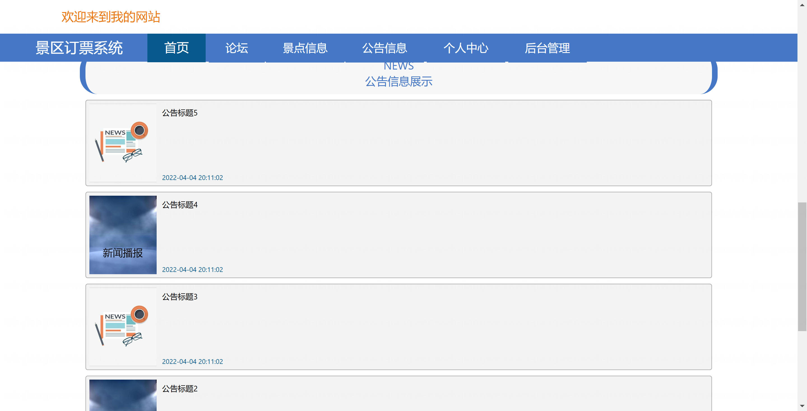

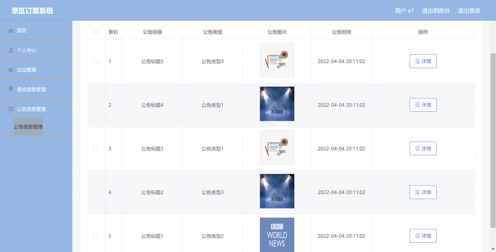

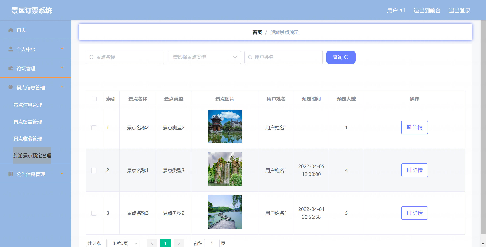

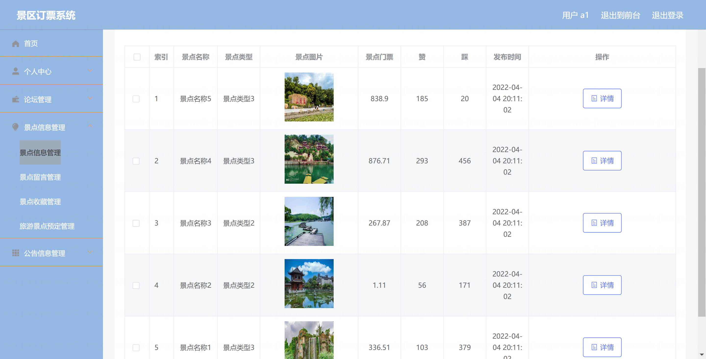
